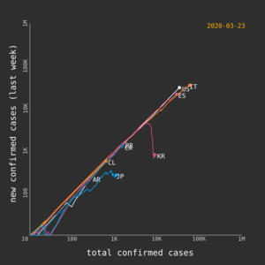

# COVID-19 Animation Generator

[](https://github.com/juancri/covid19-animation-generator/actions)

Generates an animation based on COVID-19 daily data.



- Explanation: [minutephysics: How To Tell If We're Beating COVID-19](https://www.youtube.com/watch?v=54XLXg4fYsc)
- Data:
  - [Novel Coronavirus (COVID-19) Cases, provided by JHU CSSE](https://github.com/CSSEGISandData/COVID-19)
  - [Datos covid19 en Chile by Jorge Perez](https://github.com/jorgeperezrojas/covid19-data)

## About

- Created by [JC Olivares](https://twitter.com/juancriolivares).
- Animations posted on Instagram [@covid19statsvideos](https://instagram.com/covid19statsvideos) and Twitter [@covid19statsvid](https://twitter.com/covid19statsvid)

## Requirements

- Node 12.x
- Gulp: ```npm install -g gulp```

## Initialize

- Run: ```npm install```

## Build

- Clean: ```gulp clean```
- Build: ```gulp build```

## Running

```node dist/main```

The data is downloaded automatically

### Parameters

All parameters are optional.

- ```--help```: Displays a help message and exits.
- ```--source```: Sets the data source. Default: ```global```. Possible values:
  - ```global```: Compare countries (including Chile, US and others)
  - ```southamerica```: Compare main countries in South America
  - ```us```: Compare states (US)
  - ```washington```: Compare Washington State counties (US)
  - ```chile```: Compare regions (Chile)
  - ```chile-comunas```: Compare communes (Chile)
- ```--filter```: Filters the series configurations from the datasource using its code. Multiple codes can be included, separated by comma.
- ```--schema```: Sets the color schema. Default: ```dark```. Possible values:
  - ```dark```: Dark theme
- ```--days```: Number of days for which the animation will be generated. Default: 30. Use 0 to plot all days.
- ```--frames```: Number of frames per day. Default: 30.
- ```--extraFrames```: Number of extra frames for the last image. Default: 300.
- ```--horizontalAxisLabel```: Horizontal axis label. Default: "total confirmed cases (log)".
- ```--verticalAxisLabel```: Vertical axis label. Default: "new confirmed cases (log, last week)".
- ```--zoomEasing```: Easing function for the zoom effect. Default: ```easeInOutCubic```.
- ```--timebarEasing```: Easing function for the timebar. Default: ```linear```.
- ```--dateFormat```: Sets the date format based on the [Luxon tokens](https://moment.github.io/luxon/docs/manual/formatting.html#table-of-tokens). Default: ```yyyy-MM-dd```.
- ```--drawMarkers```: Draws series markers over the scale. Disabled by default.
- ```--skipZoom```: Skips the zoom effect. Enabled by default.
- ```--hideWatermark```: Hides the watermark. Enabled by default.
- ```--seriesLineWidth```: Series line width. Default: ```3```.
- ```--horizontalMin```: Horizontal scale minimum. Default: dynamic.
- ```--horizontalMax```: Horizontal scale maximum. Default: dynamic.
- ```--verticalMin```: Vertical scale minimum. Default: dynamic.
- ```--verticalMax```: Vertical scale maximum. Default: dynamic.
- ```--scale```: Scale. Default: log. Possible values:
  - ```log```: Logaritmic (log10)
  - ```linear```: Linear scale
  - ```linear-avg7```: Liner scale with 7 days change average
- ```--scaleDateFormat```: Date format for the scale labels. Applies only for linear scale. Default: ```MM/dd```.
- ```--scaleNumberFormat```: Number format for the scale labels. Applies only for linear scale. Default: ```suffix```. Possible values:
  - ```suffix```: 1K for 1,000, 2K for 2,000, etc
  - ```plain```: Plain number
  - ```spanish```: Number in Spanish format (#.###)
- ```--stackedAreaNumberFormat```: Number format for the stacked area number label. Default: ```plain```. Possible values:
  - ```plain```: Plain number
  - ```english```: Number in English format (#,###)
  - ```spanish```: Number in Spanish format (#.###)
- ```--horizontalJump```: Distance between scale labels (horizontal axis).
- ```--verticalJump```: Distance between scale labels (vertical axis).
- ```--horizontalLines```: Horizontal lines with format numericvalue:label (example: ```10:mylabel```, multiple lines separated by comma)
- ```--verticalLines```: Vertical lines with format numericvalue:label (example: ```10:mylabel```, multiple lines separated by comma)
- ```--singleDynamicScale```: Use single axis to calculate the dynamic scale.
- ```--type```: Chart type. Default: ```line```. Possible values:
  - ```line```: Line chart
  - ```stacked-area```: Stacked area
- ```--outputDirectory```: Output directory. If the value starts with ```/```, it will be read as an absolute path. Otherwise, it will be relative to the project root. Default value: ```output```.

#### Examples

- ```node dist/main```
- ```node dist/main --source global```
- ```node dist/main --layout square```
- ```node dist/main --source us --layout vertical```
- ```node dist/main --source us --layout vertical --frames 20```

## Output

The generated images will be in the ```output``` directory

## Generate animation

You can generate an animation (60 fps). Requires ffmpeg. Run:

```
npm run video
```

The video will be here: ```output/animation.mp4```

If you used ```--outputDirectory``` to generate the images, you can pass the directory path to the video script as:

```
npm run video -- /tmp/some/temporary/directory
```


